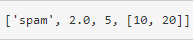
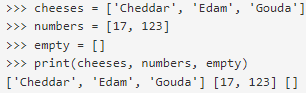
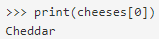
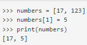

# Lists
A List is a set of values called elements or items that can be any type where each value is identified by an index, which is an integer value that indicates a value in a list.

The value inside the brackets specifies the element's index. 

